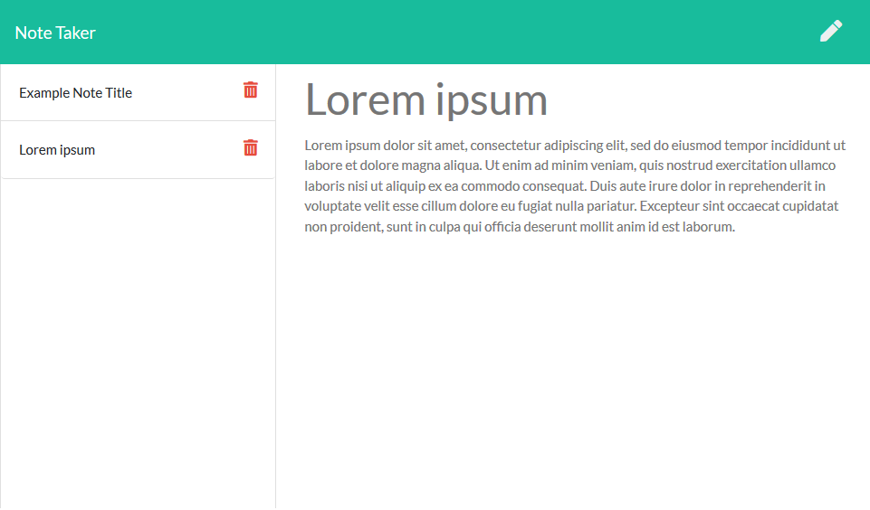

# Note Taker

## Website
[Note Taker](https://radiant-badlands-90943.herokuapp.com/) deployed on Heroku

## Screenshot

## Description

A note taking application which saves any notes back to the server it is hosted on. Notes can be viewed, created, and deleted as desired.

## Made with
- [Node.js](https://nodejs.org/en/)
- [express](https://www.npmjs.com/package/express)
- [Nano ID](https://www.npmjs.com/package/nanoid)
- ES6

## Install and Run Locally

To install locally instead of running the app on a remote server, clone the repository to your computer then run `npm i` to install all dependencies.

Start the server with `npm start` then visit localhost:\[your port number here] in your web browser.

The default port number is 3001 but can be changed either inside server.js or with a `PORT` environment variable. The active port will be printed in the console when starting the server.
